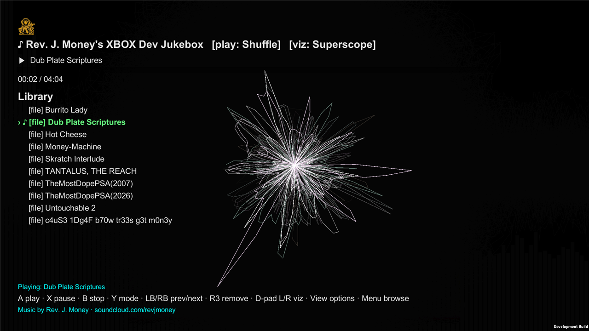
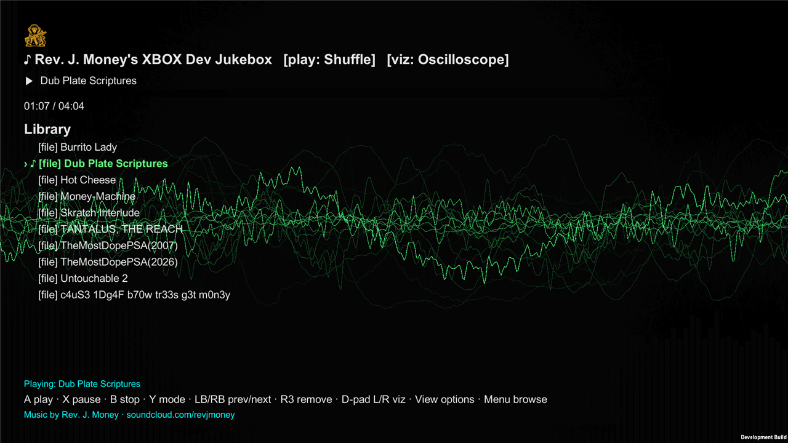
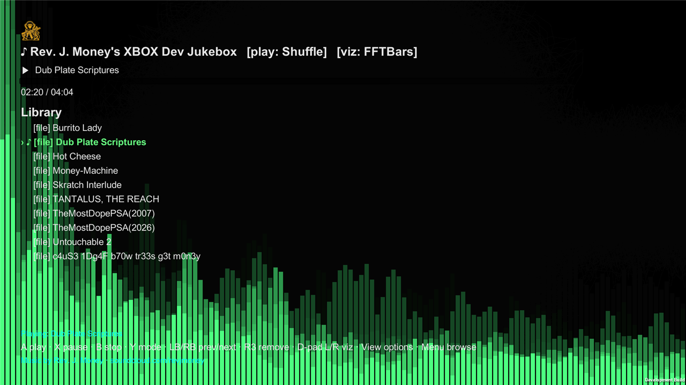
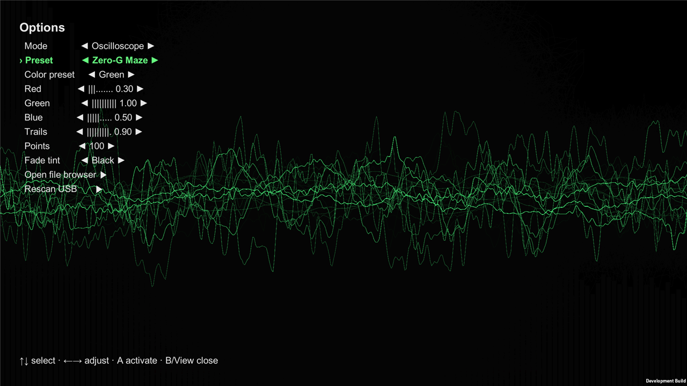
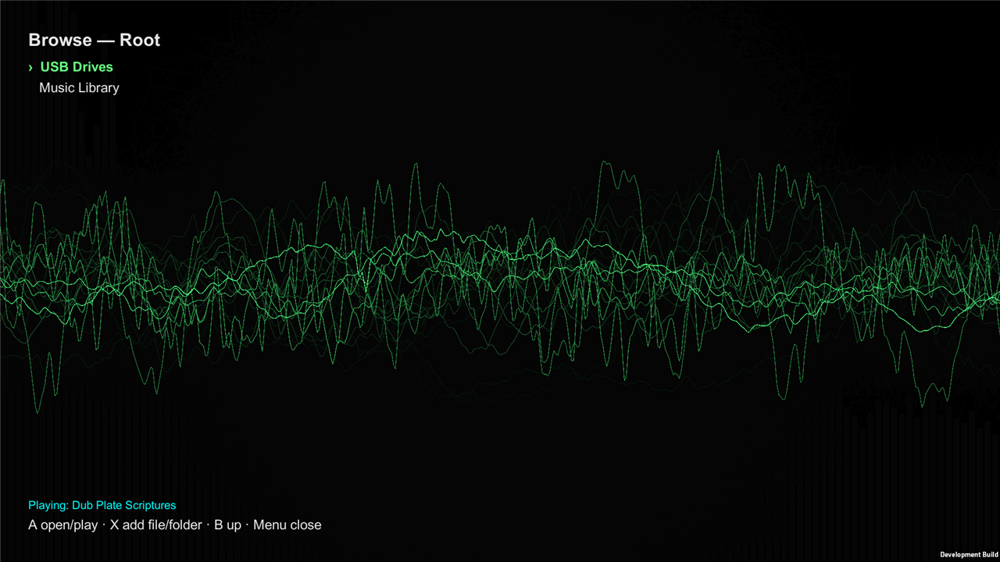

# Rev. J. Money's XBOX Dev Jukebox

A gamepad music player + Winamp-AVS-style visualizer for **any Xbox in Developer Mode**
(Xbox One / One S / One X / Series S / Series X).
Ships with original music by **Rev. J. Money** ([soundcloud.com/revjmoney](https://soundcloud.com/revjmoney)).

> This repository distributes the **sideloadable app only** — no source code. Web version:
> https://jmscnc.com/xboxjukebox/

## Download

**[Download v1.0.69.0 — RevJMoneyJukebox-1.0.69.0-sideload.zip](https://github.com/revjmoney/RevJMoneysXBOXDevJukebox/releases/latest/download/RevJMoneyJukebox-1.0.69.0-sideload.zip)**
— contains the `.appx`, the signing certificate `.cer`, and the `Microsoft.VCLibs.x64.14.00.appx` dependency.
(Also on the [Releases page](https://github.com/revjmoney/RevJMoneysXBOXDevJukebox/releases).)

## What it is

Plays bundled tracks (and your own files off USB / Music library) behind a full-screen, audio-reactive
visualizer — superscopes, oscilloscope, and FFT bars — all driven by an Xbox controller.

| Layer | Detail |
|---|---|
| Engine | Unity 2022.3 LTS, IL2CPP, x64, UWP |
| Target | Any Xbox in Developer Mode — One / One S / One X / Series S / Series X (x64, min OS 10.0.14393) |
| Audio | Native WinRT AudioGraph (MP3/FLAC) + managed **NVorbis** for OGG |
| Visualizer | NS-EEL superscope + oscilloscope + FFT bars + starfield + dot-grid, editable trails/colors |
| Effects | Dynamic Movement feedback-warp (zoom/rotate/tunnel/ripple/swirl) + blur + color FX, live |
| Library | Multiple playlists + build-your-own Custom playlist, shuffle/repeat, ID3/Vorbis/FLAC tags + cover art, USB/Music browser |

## Screenshots

*Captured straight from an Xbox console.*

| | |
|---|---|
|  |  |
| Superscope visualizer + library | Oscilloscope mode |
|  |  |
| FFT bars mode | Options — mode, preset, colors, trails |
|  | |
| File browser — USB + Music library | |

## Controls

| Button | Action |
|---|---|
| A | Play selected track |
| X | Pause / resume |
| B | Stop |
| Y | Play mode: Repeat-One → Repeat-All → Shuffle → Normal |
| LB / RB | Previous / next track |
| R3 (right stick) | Remove selected track |
| L3 (left stick) | Hide / show the HUD (clean full-screen visualizer) |
| D-pad ←/→ | Switch visualizer mode (oscilloscope / FFT / superscope / starfield / dot-grid) |
| Triggers | Seek ±10s |
| View | Options (mode, preset, playlist, colors, trails, blur, color FX, dynamic-movement warp) |
| Menu | File browser (USB + Music library) |

## Sideload instructions

1. Put your Xbox into **Developer Mode** and sign in with a user on the console.
2. Unzip `RevJMoneyJukebox-1.0.69.0-sideload.zip`.
3. Open the Xbox **Device Portal**: `https://<your-xbox-ip>:11443` (accept the cert warning).
4. **My games & apps → Add** → select the `.appx`, add the **VCLibs x64** dependency and the `.cer`
   certificate → Install.
5. Launch **Rev. J. Money's XBOX Dev Jukebox**.

**Notes:** self-signed, Developer-Mode sideload only (not a Store app). Install to **internal storage**
(external/USB installs of dev apps can fail to launch). Uninstall any previous build first.

## Credits & license

- Music & app © Rev. J. Money — soundcloud.com/revjmoney
- OGG decoding by [NVorbis](https://github.com/NVorbis/NVorbis) (MIT) — see `NOTICE.md`
- Bundled visualizer presets adapt superscope code from the Winamp AVS community (UnConeD, Tuggummi,
  S_KuPeRS, L1quid, justin, el-vis, and others) — credit to the original authors. See `NOTICE.md`.
- Built with Unity. Not affiliated with Microsoft, Xbox, or Nullsoft/Winamp.

## License

Free to use under the terms in [`LICENSE.txt`](./LICENSE.txt) (freeware: free to download & run on your
own Dev-Mode Xbox; no resale/repackaging; provided as-is, no warranty). Bundled third-party components
(NVorbis, AVS preset code) remain under their own licenses — see [`NOTICE.md`](./NOTICE.md).

